##  프로젝트 명


### LOGO


---

##  프로젝트 기간

#### **2026. 01. 02. ~ 01. 15 (총 14일)**

---

##  프로젝트 팀 및 역할

### 팀명: 에이아2조

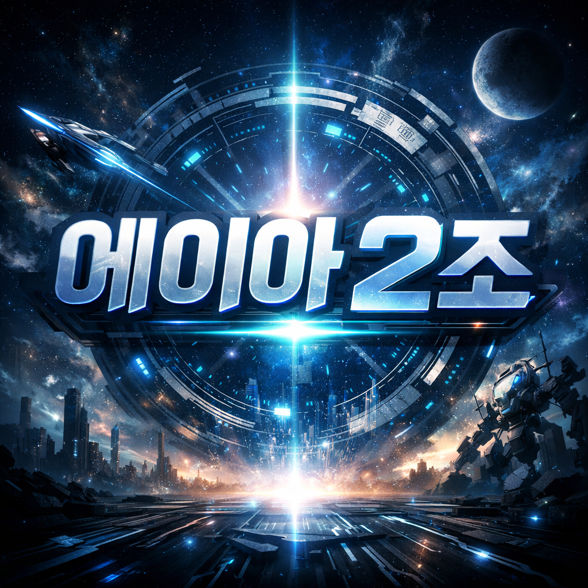

<br />

|  |  |  | |   | 
| :-:  | :-:  | :-:  | :-:  | :-:  |
| 정유선 | 정희영 | 정용희 | 유헌상 | 김도영 |
| [](https://github.com/jys96) | [](https://github.com/JUNGHEEYOUNG9090) | [](https://github.com/jungyonghi) | [](https://github.com/hunsang-you) | [](https://github.com/rubyheartsping) |

---

##  프로젝트 주제  
**ML/DL 모델 기반 노쇼 예측 및 솔루션**

---

##  개요

<br>

본 프로젝트는 제한된 데이터를 기반으로, 사용자 행동 데이터를 분석하여 **이탈 가능성**을 예측한 후 해당 데이터를 통한 노쇼 리스크로서 병원 경영에 유의미한 솔루션을 제공하는 것을 목표로 하였다.

- 기상 정보와 병명 서비스 시작일을 기반으로 진료계약 부결률을 낮춤과 동시에 단순 문자 발송 시스템이 아닌 예측형 모델로서 확률 분석을 할 수 있는 것을 목표
- 📊 사용자 행동 기반 부결 위험도 분석 및 시각화 대시보드 제공
- 👩‍💻 관리자가 전체적인 부결률을 확인 할 수 있는 관리 시스템 구현
- 🔍 다양한 모델을 기반을 최적의 모델을 찾아 적용

<br>

## 예상 작업 일정

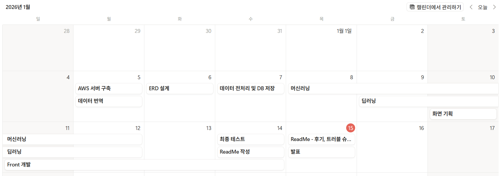

## 노쇼-프리 프로젝트 WBS (작업 현황)

| 프로젝트 이름                                 | 담당자                                              | 상태    | 시작일     | 종료일     |
| :-------------------------------------------- | :-------------------------------------------------- | :------ | :--------- | :--------- |
| 데이터 파일 번역                              | 용희 정                                             | 완료    | 2026/01/04 | 2026/01/05 |
| AWS 서버 구축                                 | 희영 정, SKN 23기\_김도영                           | 완료    | 2026/01/05 | 2026/01/05 |
| ERD                                           | 희영 정                                             | 완료    | 2026/01/06 | 2026/01/07 |
| 데이터 분석 및 사용 데이터 정리               | 희영 정, 유헌상, SKN 23기\_김도영                   | 완료    | 2026/01/05 | 2026/01/05 |
| 데이터 DB 저장                                | 희영 정                                             | 완료    | 2026/01/06 | 2026/01/06 |
| 머신러닝 개발 (Logistic Regression, LightGBM) | 유헌상                                              | 완료    | 2026/01/10 | 2026/01/14 |
| ENV 설정                                      | 유헌상                                              | 완료    | 2026/01/06 | 2026/01/06 |
| DB 저장 전 전처리                             | SKN 23기\_김도영                                    | 완료    | 2026/01/07 | 2026/01/07 |
| 모듈 함수 개발                                | 유헌상                                              | 완료    | 2026/01/07 | 2026/01/12 |
| DB icd_code 보강                              | 용희 정                                             | 완료    | 2026/01/07 | 2026/01/07 |
| DB weather 중복 데이터 처리                   | 유헌상                                              | 완료    | 2026/01/07 | 2026/01/07 |
| 딥러닝 개발                                   | SKN 23기\_김도영                                    | 완료 | 2026/01/11 |   2026/01/14         |
| EC2 인스턴스 수리                             | SKN 23기\_김도영                                    | 완료    | 2026/01/08 | 2026/01/08 |
| 모델화                                        | 용희 정                                             | 완료    | 2026/01/08 | 2026/01/09 |
| 데이터베이스 수정                             | 희영 정, SKN 23기\_김도영                           | 완료    | 2026/01/08 | 2026/01/08 |
| 사용 모델 정리                                | 용희 정, 유헌상, 희영 정, 쥐 가을, SKN 23기\_김도영 | 완료    | 2026/01/08 | 2026/01/08 |
| SMS 발송 구현                                 | SKN 23기\_김도영                                    | 완료    | 2026/01/08 | 2026/01/08 |
| 머신러닝 개발 (RandomForest, XGBoost)         | 희영 정                                             | 완료    | 2026/01/11 | 2026/01/14 |
| 딥러닝 개발                                   | 용희 정                                             | 완료 | 2026/01/09 | 2026/01/14           |
| 학습데이터 생성                               | 유헌상                                              | 완료    | 2026/01/12 | 2026/01/14 |
| 화면 설계                                     | 쥐 가을                                             | 완료    | 2026/01/10 | 2026/01/11 |
| Frontend 개발                                 | 쥐 가을                                             | 완료    | 2026/01/11 | 2026/01/15 |
| 모듈 함수 추가                                | SKN 23기\_김도영                                    | 완료    | 2026/01/12 | 2026/01/12 |
| 원핫 모듈 수정                                | SKN 23기\_김도영                                    | 완료    | 2026/01/13 | 2026/01/13 |
| 날씨 api 개발                                 | 유헌상                                              | 완료    | 2026/01/13 | 2026/01/13 |
| df에 확률 컬럼 추가 함수                      | SKN 23기\_김도영                                    | 완료    | 2026/01/13 | 2026/01/13 |
| 문자 전송 버튼 기능 구현                      | SKN 23기\_김도영                                    | 완료    | 2026/01/13 | 2026/01/14 |
| ReadMe 작성                                   | 용희 정                                             | 완료 | 2026/01/13 |    2026/01/15        |

---

##  기술스택

###  Data Processing & Analysis

<div>
  
  
</div>


###  Data Visualization


###  Frontend (Streamlit)


###  Dev Environment

<div>
  
  
  
</div>
<div>
  
  
  
  
</div>

### ERD

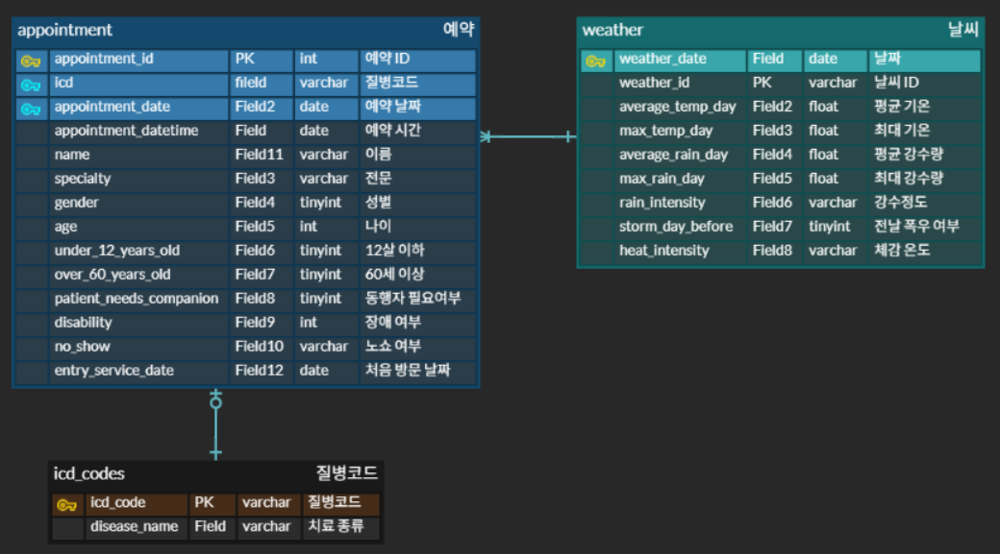

### AWS EC2 서버구축


### 프로젝트 구조

```plaintext### 폴더 및 파일 구조

your_project_name/
├── .venv/                         # 가상 환경 (git X)
├── assets                         # 이미지, 데이터 파일등을 위한 폴더
│   ├── images/                    # 이미지 폴더
│   ├── fonts/                     # font용 woff2 파일이 저장되어 있는 폴더
│		├── no_show_feature_correlations.csv
│		├── noshow_weather.csv         # weather 테이블 입력용 csv
│		├── noshow_appt.csv            # appointment 테이블 입력용 csv
│   └── medical-appointments-no-show-en.csv # 원본 데이터
│
│── api/
│   ├── weather_api.py             # 날씨 정보 API
│   └── weather_week.py            # 날씨 정보 DB에 반영
│── artifacts/                     # 모델 및 학습 데이터 정보
│   ├── feature_columns.json       # 학습에 사용한 피처 컬럼 이름
│   ├── lg_feature_columns.json    # 로지스틱 피쳐 컬럼
│   ├── lg_model.joblib            # 로지스틱 모델 평가
│   ├── lgbm_feature_columns.json  # lightGBM 피쳐 컬럼
│   ├── lgbm_model.joblib          # lightGBM 모델 평가
│   ├── mlp_model.pt               # 김도영 딥러닝 모델 정보
│   ├── scaler.joblib              # 데이터 스케일러 정보
│   ├── rf_feature_columns.json    # 랜덤포레스트 피쳐 컬럼
│   ├── rf_metrics.json            # 랜덤포레스트 평가
│   ├── rf_model.joblib            # 랜덤포레스트 모델 정보
│   ├── rf_threshold.json          # 랜덤포레스트 판단 값
│   ├── xgb_feature_columns.json   # XBBoost 피쳐 컬럼
│   ├── xgb_metrics.json           # XBBoost 평가
│   ├── xgb_model.joblib           # XBBoost 모델 저정보
│   └── xgb_threshold.json         # XBBoost 판단 값
│── services/
│   └── customerService.py         # 스트림릿 모델 불러오기 및 확률 계산 함수
│
├── src/
│   ├── modules/                   # 모듈 파일들로 구성된 폴더
│   │   ├── connect_db_module.py    # DB 연결 모듈
│   │   ├── machine_module.py       # 머신러닝 모듈
│   │   ├── one_hot_module.py       # 컬럼 원핫인코딩용 모듈
│   │   ├── predict_noshow_logistic.py    # 로지스틱 모델 확률 예측 모듈
│   │   ├── predict_noshow_lightgbm.py    # lightGBM 모델 확률 예측 모듈
│   │   ├── DL_KDY.py               # 김도영 딥러닝 학습 파일
│   │   ├── xgboost.py              # xgboost 머신러닝
│   │   └── randomForest.py         # 랜덤포레스트 머신러닝
│   └── views/                     # 화면 페이지 정의 폴더
│       ├── CustomerList.py        # 고객 관리 페이지
│       ├── Dashboard.py           # 대시보드 페이지
│       ├── MoedelAnalytics.py     # 모델 성능 확인 페이지
│       ├── .streamlit/
│       │   └── config.toml        # streamlit 테마 설정 파일
│       ├── modals/
│       │   ├── editInfoModal.py   # 메세지 전송 모덜
│       │   ├── messageModal.py    # 메세지 전송 모덜
│       │   └── weatherModal.py    # 날씨 유형별 노쇼 예측 비율 모덜
│       └── tabs/
│           ├── deepTap.py         # 딥러닝 모델 성능 확인 탭
│           └── machineTap.py      # 머신러닝 모델 성능 확인 탭
├── .env                           # (git X) 환경변수 파일
├── .gitignore
├── Main.py                        # 앱의 메인 시작 파일
├── README.md
├── requirements.txt               # 프로젝트 의존성 목록
└── user_flow.drawio               # 화면흐름도 drawio 파일
```

<br>

##  데이터 및 모델링 개요 (Data & Modeling)


### Data Setup
- **데이터 구조**: 49593회의 환자의 간단한 진료 정보 및 날짜 데이터가 보관됨.


## 모델 별 전처리 시 확인 포인트

1. 원핫인코딩은 별도 모듈로 진행할 예정이므로 해당하는 컬럼은 원상태 유지
2. 결측치 자체가 의미있는 컬럼은 결측치 유지
3. no_show_reason 컬럼 삭제 (해당 컬럼이 있으면 데이터 누수 발생 위험 있음)
4. 상기 삭제 제외 컬럼 수 유지
5. 날짜 / 시간 컬럼은 표준 문자열 포맷으로 변환
6. 그 외에는 타입 기반을 채움
7. 문자열 표준화
8. 숫자형 데이터의 결측치는 중간값, 문자형 데이터의 결측치는 unknown으로 채움
9. 나이, 월 >> 정수형으로 바꾸기
10. 성별 i 제거하고 gender, appointment_shift 컬럼 0 / 1로 맵핑
11. appointment_datetime, weather_date 이라는 새 컬럼 만들기

## 머신러닝

1. Logistic Regression (유헌상)

| 모델 (Threshold = 0.185) | AUC    | Accuracy | Precision | Recall | F1     |
| ------------------------ | ------ | -------- | --------- | ------ | ------ |
| LogisticRegression       | 0.6072 | 0.7567   | 0.1438    | 0.3023 | 0.1949 |

- Precision 0.1438, Recall 0.3023
- 노쇼를 더 잡기 위해 threshold를 낮췄지만 Precision이 낮아 **False Positive(노쇼로 잘못 경고)**가 많이 발생
- 선형 모델이라 복잡한 상호작용을 잘 반영하지 못해 확률 분리(AUC)도 낮은 편
- 노쇼를 탐지하고 예측하기엔 불리
- 해석은 쉽지만(선형), 노쇼 탐지 성능이 제한적
- threshold를 낮춰도 Precision 손실이 커서 운영에서 경고 과다 가능

2. RandomForest (정희영)

| 모델         | Train F1 | Test F1 | Test Precision | Test Recall |
| ------------ | -------- | ------- | -------------- | ----------- |
| RandomForest | 0.8973   | 0.3553  | 0.3583         | 0.3524      |

- 원핫 인코딩 적용을 통해 최대한 데이터 숫자화
- imbalance 사용하여 불균형 데이터 처리
- class_weight 사용

3. XGBoost (정희영)

| 모델    | Train F1 | Test F1 | Test Precision | Test Recall |
| ------- | -------- | ------- | -------------- | ----------- |
| XGBoost | 0.8649   | 0.2567  | 0.1622         | 0.6147      |

- 원핫 인코딩 적용을 통해 최대한 데이터 숫자화
- imbalance 사용하여 불균형 데이터 처리
- 하이퍼파라미터 수정
- scale_pos_weight 사용
- Threshold Optimization 사용하여 불균형 데이터 처리 Threshold : 0.5)
- SMOTH 사용하여 불군형 데이터 처리

4. LightGBM (유헌상)

| 모델     | AUC    | Accuracy | Precision | Recall | F1     |
| -------- | ------ | -------- | --------- | ------ | ------ |
| LightGBM | 0.7288 | 0.7936   | 0.2312    | 0.4814 | 0.3124 |

- Precision 0.2312, Recall 0.4814
- Logistic보다 노쇼를 더 많이 잡으면서(Recall↑), 예측의 정확도(Precision)도 더 높음
- F1도 더 높아(0.3124) precision/recall 균형이 Logistic보다 우수
- AUC/Accuracy/Precision/Recall/F1 전 지표에서 우세
- 특히 노쇼 탐지 목적(Recall 중심)에서 threshold 0.185 설정 시 Recall 0.48 수준으로 실무적 활용 가치가 더 큼

#### 딥러닝

MLP
| 모델 | Train F1 | Test F1 | Test Precision | Test Recall |
|----------|----------|---------|----------------|--------------|
| MLP (다층퍼셉트론) | - | 0.3224 | 0.3095 | 0.3364 |

---

## 화면 설계

### 사이트 구조

```

노쇼프리 사이트
   ├── Dashboard (main)
   │      └── 날씨별 노쇼 예측 모덜
   ├── 고객 관리
   │      ├── 메세지 전송 모덜
   │      └── 고객 정보 수정 모덜
   └── 모델 성능 확인
          ├── 머신러닝 탭
          └── 딥러닝 탭

```

### 화면 흐름도 (User Flow) - drawio 이용

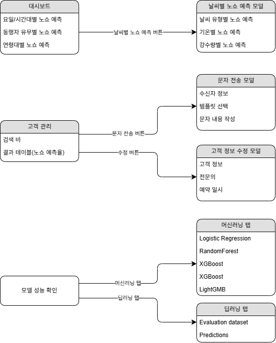

### 사이트 맵 (Site Map) - Reuim AI 이용

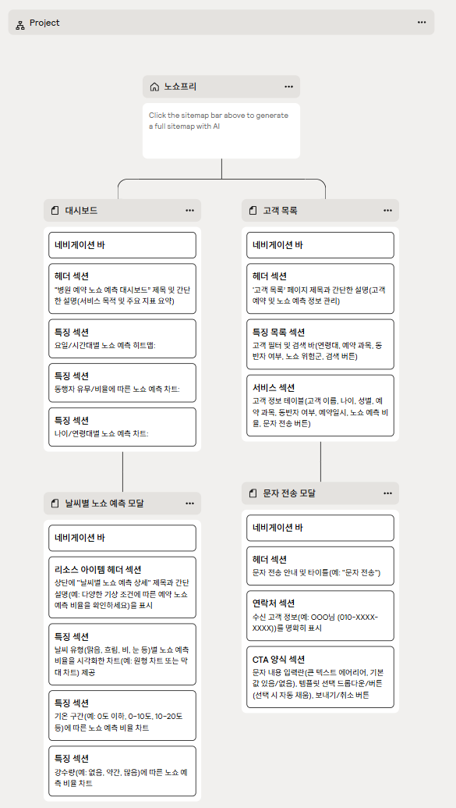

### 와이어프레임 (Wireframe) - Figma 이용

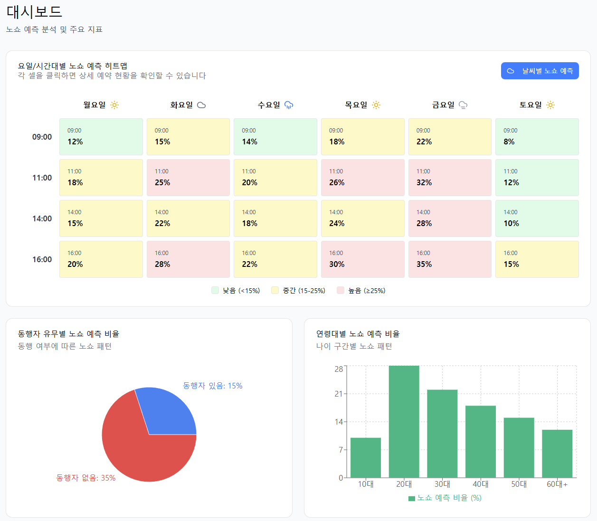

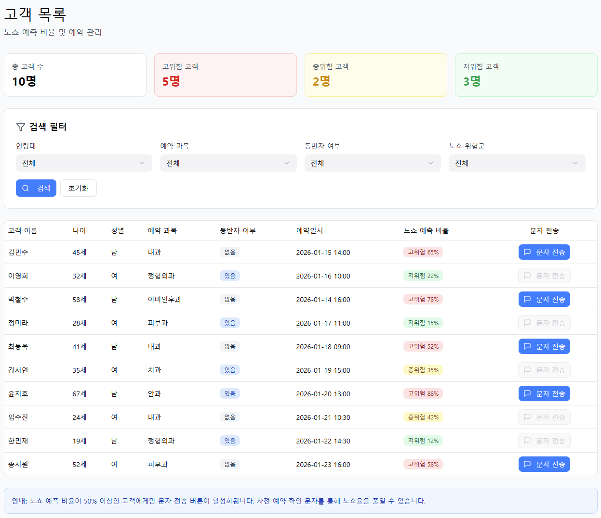

### 테마(색상, 글꼴, 폰트사이즈) 정의

```
1. 글꼴
    - 한글: Pretendard(파일), 나눔스퀘어(파일)

2. 글꼴 크기
    - 제목: 26 / 44
    - 본문: 16

3. 색상 코드
    1. 전체 배경: F8FAFB
    2. 포인트: 2D6CDF
    3. 글자: 242424
    4. 빨강: DB403E / 배경: 10%
    5. 주황: FF6200 / 배경: 10%
    6. 초록: 22C55E / 배경: 10%
    7. 파랑: 3A7BFF / 배경: 10%
    8. 보라: 7331DE / 배경: 10%
    9. 회색
      - 배경: F0F0F0
      - 테두리: D7D7D7, F9FAFB
      - 일반: 7C7C7C
    10. 흰색: FFFFFF
```

##  개발 화면 (Streamlit Application Features)

####  대시보드

<div style="display: block; justify-content: center; gap: 20px;">
  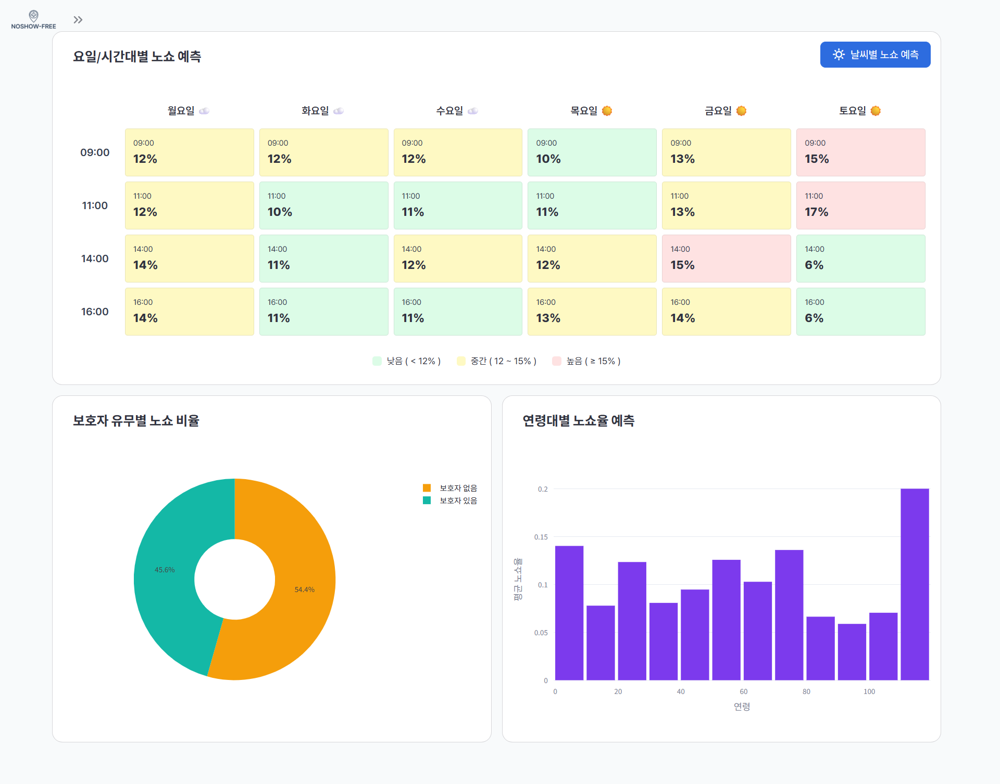
  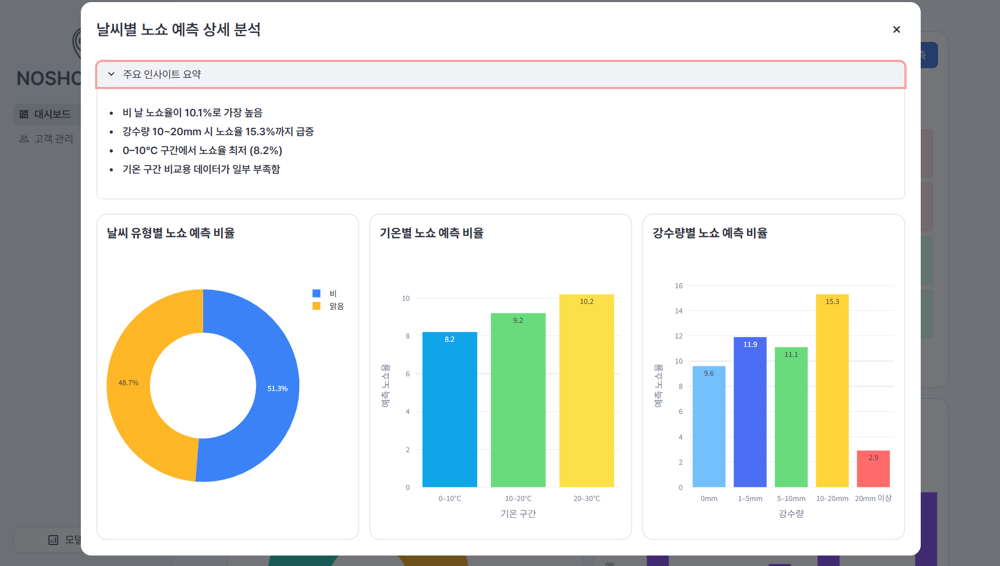
</div>
저희 대시보드는 노쇼(No-Show) 현상을 다각도로 분석하고 예측할 수 있는 다양한 차트와 모델을 제공합니다.

- **DASHBOARD:**

  - **요일/시간대별 노쇼율:** 요일과 시간대에 따른 노쇼 발생 경향을 직관적으로 파악할 수 있습니다.
  - **연령대별 노쇼율:** 연령대별 노쇼율을 분석하여 특정 연령층의 노쇼 특성을 이해하는 데 도움을 줍니다.
  - **보호자 유무별 노쇼 비율:** 보호자 동반 여부에 따른 노쇼 비율 차이를 비교하여 의미 있는 인사이트를 도출할 수 있습니다.

- **날씨별 노쇼 예측 모덜:**
  - **주요 인사이트 요약:** 날씨 관련 노쇼 예측의 핵심적인 분석 결과를 요약하여 제공합니다.
  - **날씨 유형별 노쇼 예측 비율 (차트):** 맑음, 비, 눈 등 다양한 날씨 유형에 따른 노쇼 예측 비율을 시각적으로 확인할 수 있습니다.
  - **기온별 노쇼 예측 비율 (차트):** 기온 변화가 노쇼 발생에 미치는 영향을 분석하여 특정 기온 구간에서의 노쇼 예측 비율을 파악합니다.
  - **강수량별 노쇼 예측 비율 (차트):** 강수량에 따른 노쇼 예측 비율을 제공하여 비의 양이 노쇼에 미치는 영향을 분석합니다

####  고객 관리

<div style="display: block; justify-content: center; gap: 20px;">
  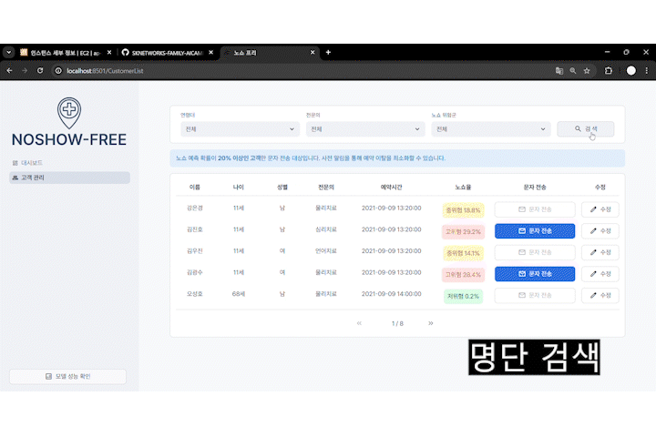
  <p><b>명단검색:</b> 상단 검색바를 통해 연령대, 전문의, 노쇼 위험군 등 다양한 조건으로 고객 명단을 검색할 수 있어 필요한 정보를 빠르고 효율적으로 찾아볼 수 있습니다.</p>
  
  <p><b>확률 재계산:</b> 회원 정보 수정 시, 변경된 데이터를 바탕으로 노쇼율이 자동으로 재계산되어 즉각적으로 업데이트된 위험도를 확인할 수 있습니다. 이를 통해 항상 최신 정보로 고객 관리가 가능합니다.</p>
  
  <p><b>문자발송:</b> 노쇼 위험군으로 분류된 고객에게 예약 확인 문자를 손쉽게 발송하여, 노쇼율 감소를 위한 능동적이고 선제적인 조치를 취할 수 있습니다.</p>
</div>

####  모델 성능 확인

<div style="display: block; justify-content: center; gap: 20px;">
  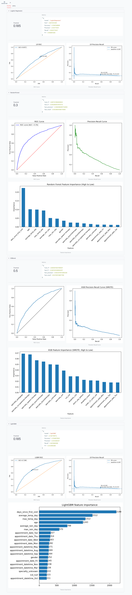
  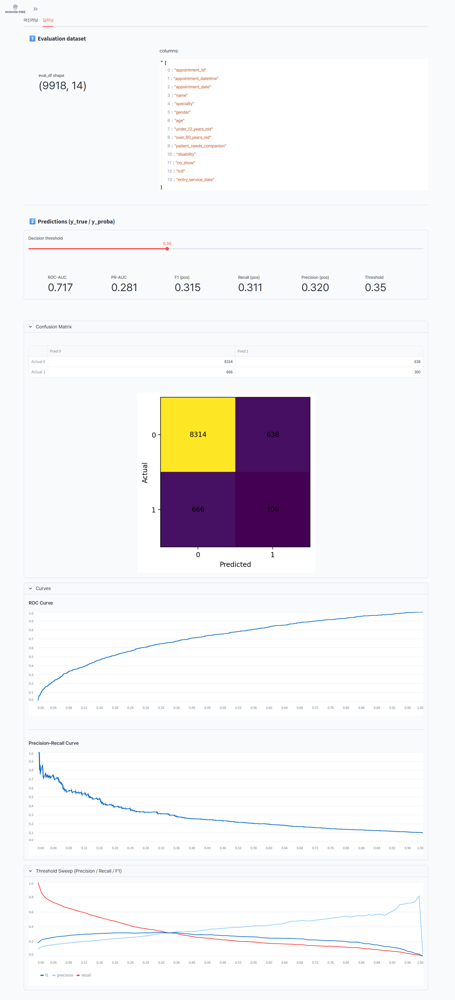
</div>
---

##  참고 자료

- **사이트맵**: [Relume](https://www.relume.io/app/project/P2915713_1XA8Fs9P4U9kcjvvRgOZ82yYzPZGE9wn4DUIbtjBN9s#mode=sitemap)
- **와이어프레임**: [Figma](https://www.figma.com/make/hXkr5jZ5bEUNxNzj75iTbh/Hospital-Management-System-Wireframe?t=JJtGxAYhqcfxashS-1)
- **ERD**: [ERD CLOUD](https://www.erdcloud.com/d/GofibWbvH9bF45oRg)
- **title**: [text](link)
- **title**: [text](link)
- **title**: [text](link)
- **title**: [text](link)
- **title**: [text](link)
- **title**: [text](link)
- **title**: [text](link)

---

##  팀원별 회고

|  이름 |                                                                                                                                                                                                                                                                                                                                                                                                                                                                                                                                                                                                                             |
| ------------------------------------------------------------------------------------------------------------------- | ---------------------------------------------------------------------------------------------------------------------------------------------------------------------------------------------------------------------------------------------------------------------------------------------------------------------------------------------------------------------------------------------------------------------------------------------------------------------------------------------------------------------------------------------------------------------------------------------------------------------------------------------------------------------------------------------------------------------------------------------- |
| **정유선**                                                                                                          | 이번 '가입 고객 이탈' 예측 머신러닝/딥러닝 프로젝트에서 다시 한번 팀장을 맡아 성공적으로 이끌 수 있었음에 큰 보람을 느낍니다. <br> 훌륭한 팀원들을 만나 서로 협력하며 즐거운 분위기 속에서 효율적으로 작업을 진행할 수 있었습니다. 덕분에 난관들도 슬기롭게 극복하며 프로젝트를 성공적으로 마무리할 수 있었습니다. <br> 비록 업무 분배상 머신러닝/딥러닝 개발에 직접 참여하지 못한 점은 개인적인 아쉬움으로 남지만, 전체 프로젝트를 조망하고 팀을 이끄는 귀중한 경험을 통해 리더십과 기획 역량을 더욱 향상시킬 수 있었습니다. <br> 이번 경험을 발판 삼아 다음 프로젝트에서는 핵심 기술 구현에도 적극적으로 기여하며 성장하고 싶습니다.                                                                                                         |
| **정희영**                                                                                                          | 이번 프로젝트에서 수행한 역할은 DB 및 머신러닝 모델을 돌리는 것이었다. DB를 어떻게 관리하느냐에 따라 전처리 과정이 달라질 수 있다고 생각했기 때문에 ERD 부터 설계를담당하였으나 전처리 과정에서 여러 가지 작업을 하면서 DB는 기억이고 전처리가 활용이라는 것을 몸소 느낄 수 있었다. <br> 꾸준히 배워왔으나 아직까지도 익숙하지 않은 머신러닝에 대해서 다시 한 번 학습할 수 있는 기회가 되었고, 모델을 작성하면서 어떻게든 성능을 끌어올리기 위해 많은 노력을 기울였으나 만족스럽지 않은 성능이 나왔다는 점이 아쉬움으로 남았다. <br> 이번 프로젝트를 통해 팀원간의 협업이 중요하고 자신의 맡은 바 역할을 수행해야 높은 시너지가 나올 수 있다는 것을 다시 한 번 깨닫게 되었고 추후에 더 높은 경험을 쌓을 수 있을 밑거름이 될 것이라고 생각했다. |
| **정용희**                                                                                                          | text !!                                                                                                                                                                                                                                                                                                                                                                                                                                                                                                                                                                                                                                                                                                                                        |
| **유헌상**                                                                                                          | 프로젝트의 모듈화와 머신러닝의 Logistic, LightGBM 모델을 사용하여 노쇼율을 예측하였는데, 머신러닝과 딥러닝 수업때도 명확하게 알지 못했던 부분이 많았어서 이번 프로젝트 에서는 방향을 제대로 못잡고 헤맸던 느낌이 없지않다. 또, 몸이 아프게 되어 할 수 있었음에도 불구하고 못한 것이 있다고 생각되어 아쉽다.                                                                                                                                                                                                                                                                                                                                                                                                                                    |
| **김도영**                                                                                                          | 딥러닝 모델을 학습시키고 사용하는데에 데이터 선정, 전처리 및 효율적인 모델 구축 등 수많은 과정이 필요하다는 것을 확인할 수 있는 프로젝트였습니다. <br> 한편으로는 최초 모듈 및 모듈 내부의 함수를 작성함에 있어 명확한 목적의식을 가지고 작성해야 장기적으로 모듈과 함수끼리 꼬이는 일을 방지할 수 있음을 절실히 느꼈습니다. <br> 프로젝트 기간 동안 모델 학습이며 모듈화, DB 작업 등 각종 작업에 열정적으로 임해주신 팀원 모두와 일정 관리, 청사진 제시 등 프로젝트의 운영을 도맡아 주신 팀장님께 감사의 말씀 드리고자 합니다.                                                                                                                                                                                                                |

## 트러블 슈팅

| 이름       | 내용                                                                                                                                                                                                                                                                                                                                                                                                                                                                                                                                                                                                                                                                                                                                                                                                                                                                                                                                                                                                        |
| ---------- | ----------------------------------------------------------------------------------------------------------------------------------------------------------------------------------------------------------------------------------------------------------------------------------------------------------------------------------------------------------------------------------------------------------------------------------------------------------------------------------------------------------------------------------------------------------------------------------------------------------------------------------------------------------------------------------------------------------------------------------------------------------------------------------------------------------------------------------------------------------------------------------------------------------------------------------------------------------------------------------------------------------- |
| **정유선** | - 팀장으로서의 업무 분배 고민: 프로젝트 초기, 팀원들의 역량을 고려한 역할 분담과 효율적인 기획에 많은 고민이 있었습니다. 팀원들의 강점을 살려 신중하게 업무를 배분하고, 명확한 로드맵을 수립하며 초기 기획의 중요성을 다시 한번 깨달았습니다.<br> - 기획 단계 의견 충돌 (메시지 기능 도입 사유): '가입 고객 이탈' 예측 서비스에 메시지 기능 포함 여부로 팀원 간 의견 차이가 있었습니다. UX 측면의 중요성을 인정한 후, 핵심 기능에 지장 없는 범위 내에서 구현하기로 합의했습니다.<br> - 프론트엔드 화면 캐시 이슈: 화면 캐시 문제로 변경 사항이 반영되지 않아 4시간 이상 어려움을 겪었습니다. 다양한 시도 끝에 코드를 롤백하여 해결했으며, 캐시 관리의 중요성과 문제 발생 시 빠른 롤백 전략의 필요성을 배웠습니다.<br> - 프론트엔드 초기화 버튼 구현 포기: 사용자 편의를 위한 '초기화 버튼' 구현이 다른 핵심 기능과 충돌하여 예상치 못한 버그를 유발했습니다. 서비스 안정성이 최우선이라는 판단하에 구현을 포기했으며, 유저 편의 기능 추가 시 기존 기능과의 호환성 고려의 중요성을 깨닫는 계기가 되었습니다. |
| **정희영** | text                                                                                                                                                                                                                                                                                                                                                                                                                                                                                                                                                                                                                                                                                                                                                                                                                                                                                                                                                                                                        |
| **정용희** | text                                                                                                                                                                                                                                                                                                                                                                                                                                                                                                                                                                                                                                                                                                                                                                                                                                                                                                                                                                                                        |
| **유헌상** | text                                                                                                                                                                                                                                                                                                                                                                                                                                                                                                                                                                                                                                                                                                                                                                                                                                                                                                                                                                                                        |
| **김도영** | text                                                                                                                                                                                                                                                                                                                                                                                                                                                                                                                                                                                                                                                                                                                                                                                                                                                                                                                                                                                                        |
